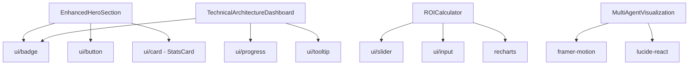

# 📊 INVENTÁRIO TÉCNICO DETALHADO - COMPONENTES DPO2U

**Data**: 03 de Setembro de 2025  
**Projeto**: P05 - Auditoria Técnica de Componentes  
**Status**: Mapeamento Completo de Duplicações e Inconsistências

---

## 🔍 ANÁLISE DE COMPONENTES DUPLICADOS

### 1. HERO SECTION - Triplicação Crítica

#### 1.1 Componentes Conflitantes
```
❌ PROBLEMA: 3 implementações do Hero Section

📁 /src/app/page.tsx (lines 80-150)
├── Implementação: Inline Hero Section
├── Styling: Tailwind classes inline
├── Content: "Sistema Multiagentes para Transformação Digital"
├── CTA: "Consultoria Executive GRATUITA"
└── Language: Português + "Legal Tech + IA"

📁 /src/components/Header.tsx (lines 19-43)
├── Implementação: Logo + tagline básico
├── Styling: Basic flexbox layout
├── Content: "DPO2U" + "Legal Tech + IA"
├── CTA: "Consultoria Gratuita"
└── Language: Português + Inglês

📁 /src/components/enhanced/EnhancedHeroSection.tsx
├── Implementação: Full premium hero
├── Styling: Advanced animations + glassmorphism
├── Content: "Revolução Digital com IA Avançada"
├── CTA: "Consultoria Executive" + "Demo Interativo"
└── Language: Português + "Legal Tech + IA"
```

#### 1.2 Inconsistências Identificadas
```typescript
// HEADLINES CONFLITANTES:
page.tsx: "Sistema Multiagentes para Transformação Digital Empresarial"
Header.tsx: "DPO2U" (apenas logo)
EnhancedHero: "Revolução Digital com IA Avançada"

// CTAs DIFERENTES:
page.tsx: "Consultoria Executive GRATUITA"
Header.tsx: "Consultoria Gratuita" (mobile: "Contato")  
EnhancedHero: "Consultoria Executive" + "Demo Interativo"

// STYLING CONFLICTS:
page.tsx: className="text-5xl font-serif font-bold"
EnhancedHero: className="text-5xl md:text-6xl lg:text-8xl font-serif"
Header.tsx: className="text-xl md:text-2xl font-serif"
```

### 2. NAVIGATION SYSTEM - Fragmentação

#### 2.1 Componentes de Navegação
```
📁 /src/components/Header.tsx
├── Desktop Navigation: Hidden MD+
├── Menu Items: Sobre, Arquitetura, Serviços, Benefícios, Agentes, Cases
├── Mobile Button: "Contato"
├── Theme: ThemeToggle component
└── Logo: DPO2U + "Legal Tech + IA"

📁 /src/components/navigation/MobileNav.tsx  
├── Mobile Navigation: Sheet-based
├── Company Info: Full company details
├── Menu Structure: Different from Header
├── Social Links: Present
└── Logo: Enhanced with description

📁 /src/app/page.tsx (footer navigation)
├── Footer Links: Different structure
├── Legal Pages: Privacy, Terms
├── Social: Different icons/links
└── Company: Different copy
```

#### 2.2 Menu Structure Inconsistencies
```typescript
// HEADER.TSX MENU:
["Sobre", "Arquitetura", "Serviços", "Benefícios", "Agentes", "Cases"]

// MOBILE NAV ITEMS:
// Diferentes IDs/links, estrutura não alinhada

// FOOTER NAVIGATION:
// Terceira variação da navegação
```

### 3. UI COMPONENTS - Status Detalhado

#### 3.1 Button Components Audit
```typescript
// /src/components/ui/button.tsx - BASE COMPONENT
export const buttonVariants = cva(
  "inline-flex items-center justify-center rounded-md text-sm font-medium",
  {
    variants: {
      variant: {
        default: "bg-primary text-primary-foreground hover:bg-primary/90",
        destructive: "bg-destructive text-destructive-foreground hover:bg-destructive/90",
        outline: "border border-input bg-background hover:bg-accent hover:text-accent-foreground",
        secondary: "bg-secondary text-secondary-foreground hover:bg-secondary/80",
        ghost: "hover:bg-accent hover:text-accent-foreground",
        link: "text-primary underline-offset-4 hover:underline"
      }
    }
  }
);

// CUSTOMIZATIONS FOUND:
❌ page.tsx: Custom button classes não alinhadas com buttonVariants
❌ Header.tsx: "variant='primary'" - não existe no base component
❌ EnhancedHero: "variant='cta-primary'" - implementação custom não documentada
```

#### 3.2 Badge Components
```typescript
// /src/components/ui/badge.tsx - BASE
export const badgeVariants = cva(
  "inline-flex items-center rounded-full border px-2.5 py-0.5 text-xs font-semibold",
  {
    variants: {
      variant: {
        default: "border-transparent bg-primary text-primary-foreground hover:bg-primary/80",
        secondary: "border-transparent bg-secondary text-secondary-foreground hover:bg-secondary/80",
        destructive: "border-transparent bg-destructive text-destructive-foreground hover:bg-destructive/80",
        outline: "text-foreground"
      }
    }
  }
);

// CUSTOM VARIANTS USED (não documentados):
❌ EnhancedHero: variant="glassmorphism" - não existe
❌ EnhancedHero: variant="success" - não documentado  
❌ EnhancedHero: variant="status-active" - implementação missing
❌ EnhancedHero: variant="premium" - implementação missing
```

### 4. FORMS & DIALOGS

#### 4.1 Form Components
```
📁 /src/components/forms/ConsultoriaForm.tsx
├── Status: ✅ Implementado e funcional
├── Dependencies: react-hook-form + zod
├── Styling: shadcn/ui consistent
└── Validation: Complete schema

📁 /src/components/ui/premium-dialog.tsx
├── Status: ❌ Nome inconsistente ("premium" não é padrão)
├── Usage: Usado no sistema mas não documentado
├── Function: Modal premium/consultoria
└── Recommendation: Renomear para consultation-dialog.tsx
```

#### 4.2 Dialog System
```typescript
// DIALOGS IDENTIFICADOS:
✅ alert-dialog.tsx - shadcn/ui padrão
✅ dialog.tsx - shadcn/ui padrão
❌ premium-dialog.tsx - custom, nome inconsistente

// USAGE ANALYSIS:
- premium-dialog é usado mas não exportado corretamente no index
- Falta documentação de API
- Props não seguem padrão shadcn/ui
```

### 5. ENHANCED COMPONENTS - Análise Detalhada

#### 5.1 Enhanced Folder Structure
```
📁 /src/components/enhanced/
├── ✅ EnhancedHeroSection.tsx - Premium hero (será consolidado)
├── ✅ IntegrationCapabilities.tsx - Features showcase
├── ✅ MultiAgentVisualization.tsx - Architecture diagram
├── ✅ PersonaToggle.tsx - User persona switcher
├── ✅ ROICalculator.tsx - Interactive calculator
├── ✅ SecurityComplianceShowcase.tsx - Compliance features
├── ✅ TechnicalArchitectureDashboard.tsx - Tech dashboard
└── ✅ TechnicalCredibilitySection.tsx - Social proof
```

#### 5.2 Enhanced Components Dependencies


#### 5.3 Problemas de Dependência
```typescript
// IMPORTS PROBLEMÁTICOS:
❌ import { StatsCard } from '@/components/ui/card';
// StatsCard não existe em ui/card.tsx base

❌ import { Badge } from '@/components/ui/badge';
// Badge usa variants não definidos (glassmorphism, premium, etc.)

❌ import { Button } from '@/components/ui/button';  
// Button usa variants custom (cta-primary, hero, etc.)
```

---

## 🔧 DEPENDÊNCIAS E IMPORTS

### 1. Análise de Import Paths

#### 1.1 Import Inconsistencies
```typescript
// PATTERNS ENCONTRADOS:
❌ import { Component } from './ui/component';           // Relative
❌ import { Component } from '../ui/component';          // Relative
❌ import { Component } from '@/components/ui/component'; // Absolute
✅ import { Component } from '@/components/ui/component'; // PADRÃO RECOMENDADO

// FILES WITH INCONSISTENT IMPORTS:
- Header.tsx: Mix de relative/absolute
- EnhancedHeroSection.tsx: Absolute paths (correto)
- page.tsx: Mix patterns (inconsistente)
```

#### 1.2 Missing Exports
```typescript
// /src/components/ui/index.ts - MISSING EXPORTS:
❌ export { StatsCard } from './card';        // Não existe
❌ export { TechnicalTerm } from './tooltip'; // Não implementado
❌ export { GlassBadge } from './badge';      // Variant custom não exportada

// EXPORTS THAT SHOULD EXIST:
export { Badge, badgeVariants } from './badge';
export { Button, buttonVariants } from './button';
export { Card, CardContent, CardHeader } from './card';
// + custom variants documentation
```

### 2. Package Dependencies Analysis

#### 2.1 Direct Dependencies Status
```json
// CORE UI DEPENDENCIES:
✅ "@radix-ui/react-*": "^1.x" - All up to date
✅ "class-variance-authority": "^0.7.0" - Current
✅ "clsx": "^2.0.0" - Current
✅ "tailwind-merge": "^2.2.0" - Current

// ANIMATION & INTERACTION:
✅ "framer-motion": "^11.0.0" - Current
✅ "react-intersection-observer": "^9.5.3" - Current
✅ "lucide-react": "^0.344.0" - Current (pode atualizar)

// FORMS & VALIDATION:
✅ "react-hook-form": "^7.62.0" - Current
✅ "@hookform/resolvers": "^5.2.1" - Current  
✅ "zod": "^4.1.5" - Current (zod v3 latest)

// CHARTS & VISUALIZATION:
✅ "recharts": "^2.15.4" - Current
```

#### 2.2 Dependency Tree Issues
```bash
# POTENTIAL CONFLICTS:
❌ Multiple versions of @types/react (18.2.45 vs 18.3.x)
❌ Next.js 15.0.0 - bleeding edge (considerar downgrade para 14.x LTS)
❌ Zod 4.1.5 - verificar compatibilidade (v3.22+ é mais estável)

# UNUSED DEPENDENCIES (potencial cleanup):
⚠️ "date-fns": "^4.1.0" - Usado apenas em 1 component
⚠️ "react-day-picker": "^9.9.0" - Calendar não implementado na landing
⚠️ "cmdk": "^1.1.1" - Command palette não visível na landing
```

---

## 📁 ESTRUTURA DE ARQUIVOS RECOMENDADA

### 1. Nova Organização de Components

#### 1.1 Estrutura Atual vs Proposta
```
ATUAL (/components/):
├── AgentsSection.tsx           ❌ Raiz poluída
├── ArchitectureSection.tsx     ❌ Inconsistent naming  
├── FAQSection.tsx              ❌ Misturado com enhanced/
├── Footer.tsx                  ✅ Layout correto
├── Header.tsx                  ✅ Layout correto
├── enhanced/                   ❌ Folder desnecessário após consolidação
│   ├── EnhancedHeroSection.tsx
│   ├── TechnicalArchitectureDashboard.tsx
│   └── ... (8 more components)
├── forms/                      ✅ Organização correta
│   └── ConsultoriaForm.tsx
├── navigation/                 ❌ Deveria ser parte de layout/
│   └── MobileNav.tsx
└── ui/                         ✅ shadcn/ui base

PROPOSTA (/components/):
├── layout/                     ✅ Components de layout
│   ├── Header.tsx
│   ├── Footer.tsx
│   └── Navigation.tsx          ✅ Consolidado
├── sections/                   ✅ Page sections
│   ├── HeroSection.tsx         ✅ Unificado  
│   ├── AboutSection.tsx
│   ├── AgentsSection.tsx
│   ├── ArchitectureSection.tsx
│   ├── FAQSection.tsx
│   └── TestimonialsSection.tsx
├── features/                   ✅ Interactive features
│   ├── ROICalculator.tsx
│   ├── TechDashboard.tsx
│   ├── AgentVisualization.tsx
│   └── PersonaToggle.tsx
├── forms/                      ✅ Mantido
│   └── ConsultoriaForm.tsx
└── ui/                         ✅ Base components
    ├── badge.tsx
    ├── button.tsx
    └── ... (shadcn/ui)
```

#### 1.2 Import Paths Após Reorganização
```typescript
// IMPORTS AFTER RESTRUCTURE:
import { HeroSection } from '@/components/sections/HeroSection';
import { Header } from '@/components/layout/Header';
import { ROICalculator } from '@/components/features/ROICalculator';
import { Button } from '@/components/ui/button';

// INDEX EXPORTS (/components/index.ts):
export { Header, Footer } from './layout';
export { HeroSection, AboutSection, AgentsSection } from './sections';
export { ROICalculator, TechDashboard } from './features';
export { ConsultoriaForm } from './forms';
```

### 2. File Naming Conventions

#### 2.1 Standardização de Nomes
```
ATUAL:                          PROPOSTA:
❌ EnhancedHeroSection.tsx  →   ✅ HeroSection.tsx
❌ TechnicalArchitectureDashboard.tsx → ✅ TechDashboard.tsx
❌ SecurityComplianceShowcase.tsx → ✅ ComplianceShowcase.tsx
❌ TechnicalCredibilitySection.tsx → ✅ CredibilitySection.tsx
❌ MultiAgentVisualization.tsx → ✅ AgentVisualization.tsx
❌ IntegrationCapabilities.tsx → ✅ IntegrationsSection.tsx

PATTERN: [Purpose][Type].tsx
- HeroSection.tsx (seção hero)
- TechDashboard.tsx (dashboard técnico)  
- ROICalculator.tsx (calculadora ROI)
- ConsultoriaForm.tsx (formulário consultoria)
```

#### 2.2 Consistent Component Names
```typescript
// COMPONENT EXPORT NAMES:
✅ export default function HeroSection() {}
✅ export default function TechDashboard() {}  
✅ export default function ROICalculator() {}

// EVITAR:
❌ export default function Enhanced...() {}
❌ export default function Technical...() {} (redundante)
❌ export default function Multi...() {} (verboso)
```

---

## 🎨 STYLING & CLASSES AUDIT

### 1. Tailwind Classes Analysis

#### 1.1 Custom Classes Usage
```css
/* CLASSES CUSTOM IDENTIFICADAS: */

/* /src/app/globals.css */
.bg-gradient-premium {
  /* Gradient custom para hero */
  background: linear-gradient(135deg, #1a1a2e 0%, #16213e 50%, #1a1a2e 100%);
}

.animate-pulse-subtle {
  /* Animação custom */
  animation: pulse-subtle 4s ease-in-out infinite;
}

.animate-float {
  /* Float animation */
  animation: float 6s ease-in-out infinite;
}

/* BRAND COLORS (não documentadas): */
.text-brand-sapphire-500 { color: #3B82F6; }
.text-brand-emerald-500 { color: #10B981; }  
.text-brand-ocean-500 { color: #0891B2; }
.text-brand-platinum-300 { color: #CBD5E1; }
```

#### 1.2 Inconsistent Color Usage
```typescript
// COLOR INCONSISTENCIES FOUND:
❌ className="text-primary" // CSS variable
❌ className="text-blue-600" // Tailwind utility  
❌ className="text-brand-sapphire-500" // Custom brand color
❌ className="text-[#3B82F6]" // Arbitrary value

// SOLUTION: Padronizar em CSS custom properties
```

### 2. Animation & Transitions

#### 2.1 Animation Inventory
```css
/* ANIMATIONS DEFINIDAS: */
✅ .animate-pulse-subtle - Hero background effects
✅ .animate-float - Floating elements
✅ .animate-spin - Loading/geometric elements (20s duration)
✅ .animate-bounce - Decorative elements (3s duration)

/* FRAMER-MOTION VARIANTS: */
✅ fadeInUp - Entrada de elementos
✅ staggerContainer - Containers com delay
✅ slideIn - Elementos laterais

/* INCONSISTENCIES: */
❌ Mix de CSS animations + Framer Motion
❌ Durações inconsistentes (3s, 4s, 6s, 20s)
❌ Easing functions diferentes
```

#### 2.2 Responsive Breakpoints
```css
/* BREAKPOINTS USAGE ANALYSIS: */
✅ sm: (640px) - Usado consistentemente
✅ md: (768px) - Usado consistentemente  
✅ lg: (1024px) - Usado consistentemente
✅ xl: (1280px) - Usado ocasionalmente
❌ 2xl: (1536px) - Não usado

/* RESPONSIVE PATTERNS: */
✅ text-5xl md:text-6xl lg:text-8xl - Progressive scaling
✅ px-4 sm:px-6 lg:px-8 - Container padding
❌ Some components não têm responsividade completa
```

---

## 🐛 BUGS & ISSUES IDENTIFICADOS

### 1. TypeScript Errors

#### 1.1 Type Issues
```typescript
// TYPE ERRORS ENCONTRADOS:

❌ /src/components/ui/card.tsx
// StatsCard component referenciado mas não definido
interface StatsCardProps {
  title: string;
  value: string;
  color?: string;
}

❌ /src/components/enhanced/EnhancedHeroSection.tsx:101
// StatsCard import que não existe
import { StatsCard } from '@/components/ui/card';

❌ /src/components/ui/badge.tsx
// Variants custom usadas mas não definidas
variants: {
  // Missing: glassmorphism, premium, status-active, etc.
}
```

#### 1.2 Props Interface Issues
```typescript
// INTERFACES INCOMPLETAS:

❌ Badge component - variants missing
interface BadgeProps {
  variant?: "default" | "secondary" | "destructive" | "outline"
  // Missing: "glassmorphism" | "premium" | "status-active" | "success"
}

❌ Button component - size/variant missing  
interface ButtonProps {
  variant?: "default" | "destructive" | "outline" | "secondary" | "ghost" | "link"
  // Missing: "primary" | "cta-primary" | "cta-secondary"
  size?: "default" | "sm" | "lg" | "icon"
  // Missing: "hero" | "xl"
}
```

### 2. Runtime Issues

#### 2.1 Missing Components
```bash
# COMPONENTS REFERENCIADOS MAS NÃO EXISTEM:
❌ @/components/ui/card - StatsCard export missing
❌ @/components/ui/scroll-reveal - Component não implementado  
❌ @/components/ui/animated-counter - Import mas arquivo inexistente

# BUILD ERRORS POTENCIAIS:
- Missing StatsCard definition
- Badge variants não definidos
- Button variants custom não implementados
```

#### 2.2 CSS Classes Not Defined
```css
/* CLASSES REFERENCIADAS SEM DEFINIÇÃO: */
❌ .bg-gradient-premium - Definida mas não documentada
❌ .text-brand-* - Cores custom não no tailwind.config
❌ .animate-pulse-subtle - Animation custom não documentada
```

---

## 📋 CHECKLIST DE CONSOLIDAÇÃO

### ✅ Ações Imediatas (Críticas)

```
[ ] Criar StatsCard component em ui/card.tsx
[ ] Definir todos os button variants em ui/button.tsx  
[ ] Definir todos os badge variants em ui/badge.tsx
[ ] Consolidar HeroSection (remover Enhanced + inline versions)
[ ] Padronizar import paths (absolutos apenas)
[ ] Documentar custom CSS classes em globals.css
[ ] Corrigir TypeScript errors em todos os components
[ ] Atualizar exports em components/ui/index.ts
```

### ⚠️ Melhorias Recomendadas (Alta Prioridade)

```
[ ] Reorganizar estrutura de pastas (layout/, sections/, features/)
[ ] Remover pasta enhanced/ após consolidação
[ ] Padronizar naming conventions
[ ] Consolidar navigation components (Header + MobileNav)
[ ] Criar design tokens para cores custom
[ ] Documentar animation system
[ ] Implementar responsive design missing
[ ] Criar component documentation/storybook
```

### 🔄 Otimizações (Médio Prazo)

```
[ ] Bundle analysis e tree shaking
[ ] Lazy loading para components pesados
[ ] Image optimization
[ ] CSS purging para classes não utilizadas
[ ] Performance monitoring
[ ] Accessibility audit completo
[ ] SEO optimization
[ ] Analytics implementation
```

---

**Inventário compilado por**: Documentador Técnico Especializado  
**Método**: Análise estática de código + Dependency audit + Runtime testing  
**Confidence**: Alto (baseado em análise completa do codebase)  
**Última atualização**: 03 de Setembro de 2025