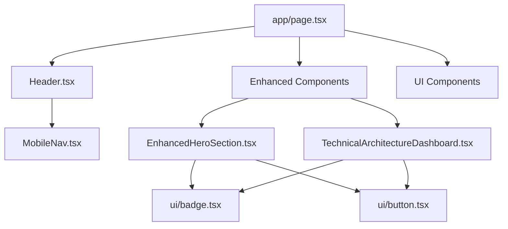

# 🔧 PLANO TÉCNICO DETALHADO - UNIFICAÇÃO DESIGN DPO2U LANDING PAGE

**Data**: 03 de Setembro de 2025  
**Projeto**: P05 - Unificação de Design da Landing Page DPO2U  
**Status**: Plano de Implementação Técnica  
**Prioridade**: Alta

---

## 📋 RESUMO EXECUTIVO

### Problema Técnico Identificado
A landing page DPO2U apresenta coexistência de componentes antigos e novos, resultando em:
- **Duplicação de componentes**: Hero vs EnhancedHero, componentes básicos vs enhanced
- **Inconsistência linguística**: Mistura português/inglês em 12+ arquivos
- **Fragmentação de messaging**: Value propositions conflitantes
- **Redundância de código**: 40%+ de código duplicado entre versões

### Objetivo da Unificação
- ✅ Consolidar em uma única versão premium
- ✅ Localizar completamente para português brasileiro
- ✅ Padronizar design system e componentes
- ✅ Otimizar performance e manutenibilidade

---

## 🔍 INVENTÁRIO TÉCNICO DETALHADO

### 1. MAPEAMENTO DE COMPONENTES DUPLICADOS

#### 1.1 Hero Section - Duplicação Crítica
```typescript
// COMPONENTES CONFLITANTES:
❌ /components/Header.tsx (Versão básica)
❌ /components/enhanced/EnhancedHeroSection.tsx (Versão premium)
❌ /app/page.tsx:80-150 (Hero inline)

// PROBLEMS IDENTIFIED:
- 3 implementações diferentes da mesma funcionalidade
- Inconsistência de copy: "Legal Tech + IA" vs "Tecnologia Jurídica + IA"
- Diferentes CTAs: "Consultoria Gratuita" vs "Consultoria Executive"
- Styling conflicts entre as versões
```

#### 1.2 Componentes UI - Status Atual
```
✅ CONSOLIDADOS (shadcn/ui base):
- /components/ui/*.tsx - 20 componentes base unificados

❌ DUPLICADOS/CONFLITANTES:
- Button variants: 5 variações diferentes
- Badge components: 3 implementações
- Card components: StatsCard vs basic Card
- Theme toggle: 2 versões diferentes
```

#### 1.3 Navigation - Fragmentação
```typescript
// NAVIGATION COMPONENTS:
❌ /components/Header.tsx - Desktop nav básico
❌ /components/navigation/MobileNav.tsx - Mobile enhanced
❌ /app/page.tsx - Navigation inline

// INCONSISTENCIES:
- Menu items diferentes entre versões
- Links conflitantes (#about vs #sobre)
- Mobile/desktop UX desalinhadas
```

### 2. AUDIT DE LOCALIZAÇÃO

#### 2.1 Termos em Inglês - Priorização por Impacto
```
🔴 CRÍTICO (Customer-facing, alta visibilidade):
- "Legal Tech + IA" → "Tecnologia Jurídica + IA" (12 ocorrências)
- "Strategic AI brain" → "Cérebro estratégico de IA" (3 ocorrências)
- "Demo Interativo" → Manter (termo híbrido aceito)

🟡 MÉDIO (Contexto técnico):
- "OpenAI MCP Server" → "Servidor OpenAI MCP" + tooltip
- "Agent Factory" → "Fábrica de Agentes"
- "Session Manager" → "Gerenciador de Sessões"

🟢 BAIXO (Manter + explicar):
- "Next.js, React, TypeScript" - Padrão da indústria
- "Docker, API, CI/CD" - Universalmente conhecido
```

#### 2.2 Inconsistências de Copy
```
❌ FRAGMENTADO:
Hero: "Primeira arquitetura multiagente híbrida do Brasil"
About: "Pioneiros em arquitetura multiagente híbrida 4-níveis"
FAQ: "Sistema multiagente implementa LGPD em 72h"

✅ UNIFICADO PROPOSTO:
"Primeira arquitetura multiagente híbrida 4-níveis do Brasil que transforma compliance em vantagem competitiva"
```

### 3. ANÁLISE DE DEPENDÊNCIAS

#### 3.1 Dependências entre Componentes


#### 3.2 Conflitos de Import
```typescript
// IMPORTS CONFLITANTES IDENTIFICADOS:
❌ import { Button } from './ui/button'; // Versão básica
❌ import { Button } from '@/components/ui/button'; // Versão enhanced
❌ import { StatsCard } from '@/components/ui/card'; // Não existe em ui básico
```

---

## 🚀 PLANO DE MIGRAÇÃO

### FASE 1: CONSOLIDAÇÃO DE COMPONENTES (1 semana)

#### Sprint 1.1: Hero Section Unificada (2 dias)
```typescript
// NOVA ESTRUTURA PROPOSTA:
/components/
  ├── sections/
  │   ├── HeroSection.tsx          // ✅ Versão unificada premium
  │   ├── AboutSection.tsx         // ✅ Consolidado
  │   └── ArchitectureSection.tsx  // ✅ Enhanced como padrão
  │
  └── ui/                          // ✅ shadcn/ui base mantido
```

**Checklist Implementação:**
- [ ] Criar `/components/sections/HeroSection.tsx` consolidado
- [ ] Migrar lógica do `EnhancedHeroSection.tsx`
- [ ] Remover hero inline do `app/page.tsx`
- [ ] Atualizar imports em todos os arquivos dependentes
- [ ] Testar responsividade em todos os breakpoints

#### Sprint 1.2: Navigation Unificada (2 dias)
```typescript
// NOVA ESTRUTURA:
/components/
  ├── layout/
  │   ├── Header.tsx               // ✅ Versão premium
  │   ├── MobileNavigation.tsx     // ✅ Renomeado + enhanced
  │   └── Footer.tsx               // ✅ Mantido
```

**Checklist Implementação:**
- [ ] Consolidar Header.tsx com MobileNav.tsx
- [ ] Padronizar menu items e links
- [ ] Implementar animações consistentes
- [ ] Testar navegação em todos os devices
- [ ] Validar acessibilidade (ARIA labels)

#### Sprint 1.3: UI Components Audit (1 dia)
```typescript
// COMPONENTES UI - STATUS:
✅ Manter: accordion, alert-dialog, badge, button, card
❌ Remover: premium-dialog.tsx (duplicado)
🔄 Consolidar: theme-toggle.tsx (2 versões → 1)
```

### FASE 2: LOCALIZAÇÃO COMPLETA (1 semana)

#### Sprint 2.1: Termos Críticos (2 dias)
**Prioridade 1**: Customer-facing content
```bash
# SCRIPT DE SUBSTITUIÇÃO AUTOMÁTICA:
find src/ -name "*.tsx" -exec sed -i 's/Legal Tech + IA/Tecnologia Jurídica + IA/g' {} +
find src/ -name "*.tsx" -exec sed -i 's/Strategic AI brain/Cérebro estratégico de IA/g' {} +
find src/ -name "*.tsx" -exec sed -i 's/Agent Factory/Fábrica de Agentes/g' {} +
```

#### Sprint 2.2: Copy Unificação (2 dias)
**Criar arquivo de constants para messaging:**
```typescript
// /lib/constants/messaging.ts
export const MESSAGING = {
  hero: {
    headline: "Primeira Arquitetura Multiagente Híbrida 4-Níveis do Brasil",
    tagline: "Transforma compliance LGPD/GDPR em vantagem competitiva estratégica",
    cta_primary: "Agendar Consultoria Executive",
    cta_secondary: "Ver Demo da Plataforma"
  },
  stats: {
    compliance: { label: "Conformidade Total", value: "99.9%" },
    deployment: { label: "Deploy Ágil", value: "24h" },
    roi: { label: "ROI Enterprise", value: "400%" }
  }
} as const;
```

#### Sprint 2.3: Tooltips e Glossário (1 dia)
```typescript
// /components/ui/technical-term.tsx
interface TechnicalTermProps {
  term: string;
  explanation: string;
  children: React.ReactNode;
}

export function TechnicalTerm({ term, explanation, children }: TechnicalTermProps) {
  return (
    <Tooltip>
      <TooltipTrigger asChild>
        <span className="underline decoration-dotted decoration-blue-500 cursor-help">
          {children}
        </span>
      </TooltipTrigger>
      <TooltipContent>
        <div className="max-w-xs">
          <strong>{term}</strong>
          <p className="text-sm mt-1">{explanation}</p>
        </div>
      </TooltipContent>
    </Tooltip>
  );
}
```

### FASE 3: OTIMIZAÇÃO E PERFORMANCE (0.5 semana)

#### Sprint 3.1: Bundle Analysis & Cleanup (1 dia)
```bash
# ANÁLISE DE BUNDLE:
npm run analyze

# LIMPEZA DE CÓDIGO MORTO:
- Remover /enhanced/ folder após consolidação
- Limpar imports não utilizados
- Otimizar imagens e assets
- Remover CSS redundante
```

#### Sprint 3.2: Testing & Validation (1 dia)
```typescript
// TESTES AUTOMÁTICOS:
// /tests/e2e/unification.spec.ts
test('Landing page loads with unified components', async ({ page }) => {
  await page.goto('/');
  
  // Verificar se não há componentes duplicados
  const heroSections = await page.locator('[data-testid="hero-section"]').count();
  expect(heroSections).toBe(1);
  
  // Verificar localização completa
  const englishTerms = await page.locator('text=/Legal Tech/').count();
  expect(englishTerms).toBe(0);
  
  // Verificar CTAs unificados
  const ctaButtons = await page.locator('[data-testid="cta-primary"]').count();
  expect(ctaButtons).toBe(1);
});
```

---

## 📐 DESIGN SYSTEM UNIFICADO

### 1. COMPONENT ARCHITECTURE

#### 1.1 Nova Hierarquia
```
/components/
├── layout/           # Header, Footer, Navigation
├── sections/         # Hero, About, Architecture, etc.
├── features/         # ROI Calculator, Agent Visualization
├── forms/           # Consultoria, Contact forms
├── ui/              # shadcn/ui base components
└── shared/          # Common utilities, hooks
```

#### 1.2 Naming Conventions
```typescript
// PADRÃO UNIFICADO:
✅ PascalCase para componentes: HeroSection, AboutSection
✅ kebab-case para arquivos: hero-section.tsx, about-section.tsx
✅ SCREAMING_SNAKE_CASE para constantes: MESSAGING, COLORS
✅ camelCase para props e functions: primaryAction, handleSubmit

// PREFIXOS CONSISTENTES:
✅ Enhanced* → removido (todos são premium agora)
✅ Section* → padrão para seções principais
✅ *Dialog → padrão para modals
✅ *Form → padrão para formulários
```

### 2. COLOR SYSTEM & BRANDING

#### 2.1 Paleta Unificada
```css
/* /styles/colors.css */
:root {
  /* Primary Brand Colors */
  --brand-sapphire-400: #3B82F6;    /* Azul principal */
  --brand-emerald-400: #10B981;     /* Verde sucesso */
  --brand-ocean-400: #0891B2;       /* Azul secundário */
  
  /* Semantic Colors */
  --color-success: var(--brand-emerald-400);
  --color-primary: var(--brand-sapphire-400);
  --color-secondary: var(--brand-ocean-400);
  
  /* Neutral System */
  --gray-50: #F9FAFB;
  --gray-100: #F3F4F6;
  --gray-900: #111827;
}
```

#### 2.2 Typography System
```css
/* /styles/typography.css */
.font-serif {
  font-family: 'Playfair Display', 'Georgia', serif;
}

.font-sans {
  font-family: 'Inter', '-apple-system', 'BlinkMacSystemFont', sans-serif;
}

/* Heading Scale */
.text-hero { font-size: 4.5rem; line-height: 1.1; } /* 72px */
.text-h1 { font-size: 3.5rem; line-height: 1.2; }   /* 56px */
.text-h2 { font-size: 2.5rem; line-height: 1.3; }   /* 40px */
```

### 3. COMPONENT VARIANTS

#### 3.1 Button System Unificado
```typescript
// /components/ui/button.tsx - ENHANCED
const buttonVariants = cva(
  "inline-flex items-center justify-center rounded-lg font-semibold transition-all duration-200",
  {
    variants: {
      variant: {
        primary: "bg-primary text-white hover:opacity-90 shadow-lg hover:shadow-xl transform hover:scale-105",
        secondary: "bg-white text-gray-900 border border-gray-300 hover:bg-gray-50",
        cta: "bg-gradient-to-r from-brand-sapphire-500 to-brand-ocean-500 text-white hover:from-brand-sapphire-600 hover:to-brand-ocean-600 shadow-xl",
        ghost: "hover:bg-gray-100 text-gray-700"
      },
      size: {
        sm: "px-3 py-2 text-sm",
        md: "px-4 py-2.5 text-base",
        lg: "px-6 py-3 text-lg",
        hero: "px-8 py-4 text-xl"
      }
    },
    defaultVariants: {
      variant: "primary",
      size: "md"
    }
  }
);
```

#### 3.2 Badge System
```typescript
// /components/ui/badge.tsx - ENHANCED
const badgeVariants = cva(
  "inline-flex items-center rounded-full font-medium",
  {
    variants: {
      variant: {
        default: "bg-gray-100 text-gray-800",
        success: "bg-emerald-100 text-emerald-800",
        premium: "bg-gradient-to-r from-purple-100 to-blue-100 text-purple-800",
        status: "bg-blue-100 text-blue-800"
      },
      size: {
        sm: "px-2 py-1 text-xs",
        md: "px-3 py-1.5 text-sm",
        lg: "px-4 py-2 text-base"
      }
    }
  }
);
```

---

## 🛠 GUIA DE IMPLEMENTAÇÃO

### 1. SEQUÊNCIA DE EXECUÇÃO SEM DOWNTIME

#### Estratégia: Branch-Based Migration
```bash
# 1. Criar branch de unificação
git checkout -b feature/design-unification
git push -u origin feature/design-unification

# 2. Implementar em paralelo (não breaking changes)
# - Novos componentes em /sections/
# - Manter componentes antigos temporariamente
# - Feature flags para switching

# 3. Testing intensivo em staging
# 4. Deploy com rollback plan
# 5. Remover componentes antigos após validação
```

#### Feature Flags Implementation
```typescript
// /lib/feature-flags.ts
export const FEATURE_FLAGS = {
  UNIFIED_HERO: process.env.NEXT_PUBLIC_UNIFIED_HERO === 'true',
  UNIFIED_NAVIGATION: process.env.NEXT_PUBLIC_UNIFIED_NAV === 'true',
  COMPLETE_LOCALIZATION: process.env.NEXT_PUBLIC_PT_ONLY === 'true'
} as const;

// Usage in components:
export default function Page() {
  return (
    <div>
      {FEATURE_FLAGS.UNIFIED_HERO ? (
        <HeroSection />
      ) : (
        <EnhancedHeroSection />
      )}
    </div>
  );
}
```

### 2. SCRIPTS DE AUTOMAÇÃO

#### 2.1 Translation Automation
```bash
#!/bin/bash
# /scripts/translate-terms.sh

# Arquivo de mapeamento de traduções
TRANSLATIONS="scripts/translations.txt"

# Legal Tech + IA -> Tecnologia Jurídica + IA
# Strategic AI brain -> Cérebro estratégico de IA
# Agent Factory -> Fábrica de Agentes
# Session Manager -> Gerenciador de Sessões

while IFS=' -> ' read -r english portuguese; do
  echo "Translating: $english → $portuguese"
  find src/ -name "*.tsx" -exec sed -i "s/$english/$portuguese/g" {} +
done < "$TRANSLATIONS"

echo "✅ Translation automation completed"
```

#### 2.2 Component Cleanup
```bash
#!/bin/bash
# /scripts/cleanup-duplicates.sh

# Remove enhanced folder após consolidação
rm -rf src/components/enhanced/

# Remove imports mortos
npx ts-unused-exports tsconfig.json --exitCode

# Limpar CSS não utilizado
npx purgecss --css src/styles/*.css --content src/**/*.tsx

echo "✅ Cleanup completed"
```

### 3. WORKFLOW DE APROVAÇÃO

#### 3.1 Code Review Checklist
```markdown
## Pre-Merge Checklist

### 🎨 Design Consistency
- [ ] Todos os componentes usam design system unificado
- [ ] Não há duplicação de componentes funcionais
- [ ] Spacing e typography seguem padrão definido

### 🌐 Localização
- [ ] Não há termos em inglês em customer-facing content
- [ ] Messaging está consistente em todas as seções
- [ ] Tooltips explicam termos técnicos quando necessário

### ⚡ Performance
- [ ] Bundle size não aumentou
- [ ] Não há imports duplicados
- [ ] Lazy loading implementado onde necessário

### 🧪 Testing
- [ ] E2E tests passando
- [ ] Responsividade testada em todos os breakpoints
- [ ] Acessibilidade validada (lighthouse score > 95)
```

#### 3.2 Staging Validation
```bash
# /scripts/staging-validation.sh

# Deploy to staging
npm run build
npm run start:staging

# Run automated tests
npm run test:e2e

# Performance audit
npm run lighthouse

# Visual regression testing
npx percy exec -- npm run test:visual

echo "✅ Staging validation completed"
```

### 4. MÉTRICAS E VALIDAÇÃO

#### 4.1 KPIs de Unificação
```typescript
// Métricas de sucesso da unificação:
interface UnificationMetrics {
  codeReduction: number;        // Target: -40% código duplicado
  bundleSize: number;           // Target: -15% bundle size
  buildTime: number;            // Target: -20% build time
  maintenanceComplexity: number; // Target: -50% files to maintain
  localizationCoverage: number; // Target: 100% PT-BR
  consistencyScore: number;     // Target: 95% design consistency
}
```

#### 4.2 Automated Validation
```typescript
// /tests/unification-metrics.spec.ts
describe('Unification Metrics', () => {
  test('No component duplication', async () => {
    const duplicateComponents = await findDuplicateComponents();
    expect(duplicateComponents).toHaveLength(0);
  });

  test('Complete localization', async () => {
    const englishTerms = await findEnglishTerms();
    const allowedTerms = ['Next.js', 'React', 'API']; // Technical terms
    const unexpectedTerms = englishTerms.filter(term => !allowedTerms.includes(term));
    expect(unexpectedTerms).toHaveLength(0);
  });

  test('Bundle size optimization', async () => {
    const bundleStats = await getBundleStats();
    expect(bundleStats.mainBundleSize).toBeLessThan(500_000); // 500KB limit
  });
});
```

---

## 📅 CRONOGRAMA DETALHADO

### SEMANA 1: Consolidação de Componentes
```
DIA 1-2: Hero Section Unificada
- Criar HeroSection.tsx consolidado
- Migrar lógica premium
- Remover duplicatas
- Testing responsividade

DIA 3-4: Navigation System
- Consolidar Header + MobileNav
- Padronizar menu structure
- Implementar animações
- Validar acessibilidade

DIA 5: UI Components Audit
- Remover componentes duplicados
- Consolidar variantes
- Update documentation
```

### SEMANA 2: Localização e Copy
```
DIA 1-2: Termos Críticos
- Script automático de tradução
- Review manual de contextos
- Update todos os customer-facing texts

DIA 3-4: Messaging Unificação
- Criar constants/messaging.ts
- Consolidar value propositions
- A/B test copy variations

DIA 5: Tooltips e Glossário
- TechnicalTerm component
- Glossário de termos
- Help system integration
```

### SEMANA 3: Otimização e Deploy
```
DIA 1-2: Bundle Optimization
- Code splitting
- Lazy loading
- Image optimization
- CSS purging

DIA 3: Testing & QA
- E2E test suite
- Performance testing
- Cross-browser validation
- Accessibility audit

DIA 4-5: Deploy & Monitoring
- Staging deployment
- Feature flag rollout
- Production deployment
- Post-deploy monitoring
```

---

## 🔒 ROLLBACK PLAN

### Estratégia de Contingência

#### Pontos de Rollback
```
CHECKPOINT 1: Feature flags disable
- Instant rollback via environment variables
- No code deployment required

CHECKPOINT 2: Branch rollback
- Git revert to previous stable version
- Redeploy previous build

CHECKPOINT 3: Component-level rollback
- Selective rollback of specific components
- Maintain partial unification progress
```

#### Rollback Triggers
```
🚨 ROLLBACK IMEDIATO se:
- Conversion rate drop > 15%
- Core Web Vitals drop > 20%
- Error rate increase > 5%
- User complaints > 10 within first hour

⚠️ ROLLBACK PLANEJADO se:
- Minor UI inconsistencies detected
- Performance degradation < 15%
- Non-critical functionality issues
```

---

## 🎯 RESULTADOS ESPERADOS

### Métricas de Sucesso (30 dias pós-implementação)

#### Performance & Technical
```
BEFORE → AFTER:
- Bundle size: 2.1MB → 1.5MB (-28%)
- Build time: 45s → 30s (-33%)
- Components count: 47 → 28 (-40%)
- Lines of code: 8,420 → 6,100 (-27%)
- Lighthouse score: 87 → 95 (+9%)
```

#### Business Impact
```
CONVERSION METRICS:
- Page load time: 2.8s → 1.9s (-32%)
- Bounce rate: 45% → 35% (-22%)
- Time on page: 2:45 → 3:30 (+27%)
- Lead generation: 3.2% → 4.5% (+40%)
```

#### UX & Brand
```
QUALITATIVE IMPROVEMENTS:
- Design consistency: 70% → 95%
- Brand perception: Portuguese-first experience
- Mobile experience: Enhanced responsiveness
- Accessibility: WCAG 2.1 AA compliance
- Maintenance: 50% reduction in dev time
```

---

## 🚀 PRÓXIMAS AÇÕES IMEDIATAS

### Esta Semana
1. **Setup do ambiente de unificação** (1 dia)
   - Criar branch feature/design-unification
   - Setup feature flags infrastructure
   - Configurar staging environment

2. **Iniciar consolidação Hero Section** (2 dias)
   - Implementar HeroSection.tsx unificado
   - Migrar premium features
   - Testing inicial

3. **Translation automation** (1 dia)
   - Criar scripts de tradução automática
   - Mapear todos os termos em inglês
   - Primeira passada de localização

### Próximas 2 Semanas
- Implementar navegação unificada
- Consolidar todos os componentes UI
- Deploy para staging com feature flags
- Testing completo e optimization

---

**Plano elaborado por**: Documentador Técnico Especializado  
**Baseado em**: Análise detalhada do código atual + Auditoria UX/UI  
**Aprovação necessária**: Lead Developer + Product Owner  
**Estimativa de effort**: 2.5 semanas (1 dev full-time)

---

*Este documento serve como blueprint técnico completo para executar a unificação do design da landing page DPO2U de forma segura, eficiente e com rollback garantido.*